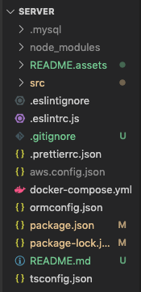
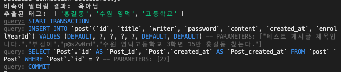

# 2주차 A기능 구현 - Backend Docs
## 📌 참고사항

* 프로젝트를 open 할때 relay11 디렉토리가 아닌 `server 디렉토리가 루트 디렉토리로 열리도록` open해 주세요.

    

* 카테고리 역할을 하는 학교, 입학년도는 모델만 구현되었으며, 임의의 카테고리에 접속한 상황으로 가정하고 구현하였습니다.

<br>

## 📌 구현된 기능

* 글쓰기 API
* 비속어 필터링
* 중요 단어를 태그로 추출

<br>

## 📌 To Do

* **C기능** 을 구현할 때 추출된 태그에 대한 데이터 구조가 정해지면 데이터 구조를 생성하고 DB에 저장하는 로직을 구현해주세요.

<br>

---

## 1.Docker 설치

서버 구동에 필요한 데이터베이스를 Docker를 이용하고 있습니다. 
옆에 링크를 통해 Docker를 설치해주세요. [링크](https://docs.docker.com/compose/install/)

<br>

## 2.DB 컨테이너 실행

도커를 설치한 다음 프로젝트의 server 디렉토리에서 다음 커맨드를 실행해줍니다.

```
docker-compose up -d
```

<br>

컨테이너를 종료할때는 다음 커맨드를 실행해줍니다.

```
docker-compose down -v
```

<br>

## 3.Server 실행

다음 명령어를 실행하여 서버 구동에 필요한 패키지들을 설치합니다.

```
npm install
```

<br>

`server` 디렉토리 아래에 aws.config.json 파일을 생성하고 아래와 같이 입력합니다.

**accessKeyId** 와 **secretAccessKey** 에는 AWS에서 발급받은 keyId와 secretKey를 입력해주세요. ([Wiki](https://github.com/boostcamp-2020/relay_11/wiki/%5Bweek2%5D-중요한-단어-태그-추출) 참고)

```
{ 
    "accessKeyId": <YOUR_ACCESS_KEY_ID>, 
    "secretAccessKey": <YOUR_SECRET_ACCESS_KEY>,
    "region": "ap-northeast-2" 
}
```

<br>

모든 패키지가 설치되었다면 서버를 실행합니다.

```
npm start
//개발시에는 npm run dev
```

<br>

## 4.API

### 글쓰기

**Request**

```http
POST "/posts"
```

<br>

**Request Body**

```json
{
    "writer" : "작성자",
    "password" : "게시글 비밀번호",
    "title": "게시글의 제목",
    "content" : "게시글의 내용"
}
```

<br>

**Response**

**정상 등록** : 게시글을 등록하고 **201 Created**로 응답합니다.


**비속어 필터링, 태그 추출 결과**



<br>

**비속어가 포함된 경우** : 게시글을 저장하지 않고 **400 Bad Request** 를 응답합니다.


